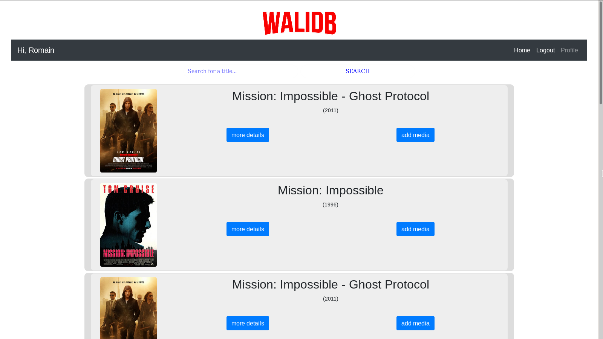
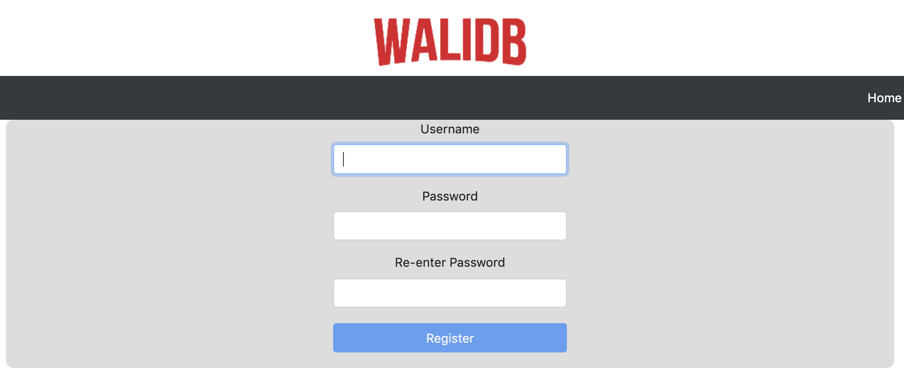

# SCALA - Projet - WaliDB

>Auteurs : Siu Aurélien, Koubaa Walid, Gallay Romain*	
> Date : 10/06/2019

## Concept

Notre but est d'offrir une application permettant de rechercher des films et de garder une trace sur les médias déjà visionnés. Ainsi un utilisateur peut se créer un compte en choisissant un pseudo et mot de passe pour ensuite se loguer sur le site. Il peut ensuite rechercher des films qui l'intéresse et les ajouter à sa liste lorsqu'il les a visionnés.

Le profil d'un utilisateur est accessible publiquement et montre les médias déjà regardés ainsi que des statistiques montrant par exemple le nombre d'heures passées à visionner sa collection de films.

## Aperçu visuel

### Page d'accueil

### Page de register

Une fois l'enregistrement auprès de WaliDB effectué, on est redirigé vers la page de login pour s'authentifier.

### Page de profil

La page de profil contient les informations de l'utilisateur connecté ainsi que la liste des médias ajoutées.

## Choix des technologie

Le backend est écrit en Scala en utilisant le **framework Play 2.7.** Nous avons choisit une base de donnée **MySQL** que nous accédons avec **Slick**. Cette base de donnée tourne sur un **Docker** que nous lançons avec *docker-compose*. Enfin le frontend a été fait en **React**, une technologie que nous trouvons agréable à utiliser et qui offre des très bonnes performances.

## Implémentation

### Scala

Notre première reflection a concerné la séparation du backend en différentes catégories: Controllers, Services, Models et DAO.

Nous avons commencé par définir les controllers pour chaque "route" présents dans le fichier routes.
Nous avons des route se chargeant de la récuperation des users, d'un user en particuleir (byId,byUsername), medias ajoutées pour un  utilisateur... 

Aussi des routes s'occupant du register,login et logout ont été définis (Login Controller).

Pour rendre les propositions de films dynamiques, nous spécifions une liste de films "populaires" statiquement coté backend, et nous affichons de facon aléatoire une recherche de ces films à chaque rafraichissement de la page principale ( Harry Potter, Iron Man, Pirate des caraibes ...) 

Le cookie de session est crée lors du login d'un utilisateur, fonction appelée par le UserController. C'est grace a ce cookie que l'affichage du profil et des médias est spécifique à l'utilisateur connecté.

### Slick

Nous avons défini les DAO de chaque entité de notre base de données SQL et spécifié pour chacune les fonctions associées, essentiellement les opérations CRUD et d'autres fonctions utiles.

Par exemple, pour UserDAO, nous avons plusieurs fonctions pour recuperer un User en fonction de son id/username, une liste des medias spcéfiques a un User mais aussi une fonction 

### React

On a  défini plusieurs composants React (Media, Search,Logo...).

Voici les composants les plus importants:

- Le composant Media représente proprement chaque média à afficher.

- Le composant Search est la barre de recherche se charge d'effectuer la requetes vers OMDB poure fetcher les médias(ici on s'est limité à des films).

- Le composant UserProfile affiche les information de l'utilisateur connecté (recuperé grace à l'identifiant contenu dans le cookie) ainsi que les médias ajoutés par l'utilisateur (présents dans le Base de Données).

- le composant Navbar est la barre de navigation contenant les bouton de redirection (userProfile,Logout,Home...)

- le composant Logo est le logo de notre application WaliDB ()

## Problèmes rencontrés

La principale difficulté de ce projet a été d'apprendre à utiliser le framework Play. En effet coder en Scala, comme nous l'avons appris durant la première partie du cours, est une chose, mais l'utiliser dans le cadre de Play nous a demandé un certain temps d'apprentissage pour se familiariser avec l'environnement. Cet apprentissage a principalement été en mode essai/erreur, en suivant des tutoriels sur le net et bien sur grâce à la documentation officielle.

Deux d'entre nous ont déjà eu l'occasion de travailler sur Spring et Spring Boot durant le cours d'AMT, mais le troisième a du découvrir les notions qui accompagnent ce type de framework, par exemple les injections de dépendances ou l'abstraction d'un certain nombre de concepts.

Nous avons eu un chapitre sur les Futures durant le cours. Néanmoins nous avons pu remarquer que leur utilisation n'était pas toujours simple, comme c'est par ailleurs souvent le cas avec l'asynchronisme en programmation. De plus l'utilisation des Futures en Scala diffère sensiblement de la gestion de l'asynchronisme en Javascript que nous avions pu expérimenter dans le cours de TWEB. Typiquement l'utilisation de callback et surtout d'async/await n'est en général pas conseillée alors qu'on les trouve fréquemment en Javascript.

Au départ avaient été prévu un certain nombre de fonctionnalités qui n'ont finalement pas vu le jour. Par exemple la possibilité d'avoir des séries en plus des films, celle des noter les medias ou encore des les ajouter en favoris. Cela n'aurait à priori pas posé de problèmes techniques particuliers mais nous avons vite réalisé que le temps que nous avions à disposition était réduit. Ainsi nous avons choisi d'assurer une application simple mais fonctionnelle plutôt que d'offrir des features mal inmplémentées et/ou buggées.

## Manuel d'installation

- Prérequis:

 -  Docker
 -  Play 2.7

- Installation:
 
 - Déployer la base de données en exécutant dans le dossier sql via le terminal la commande

 			docker-compose up
 		
 - Importer le projet sur intellij
 - Attendre le lancement par Play de l'application (client et serveur)